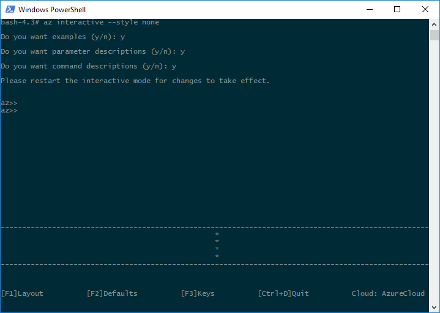
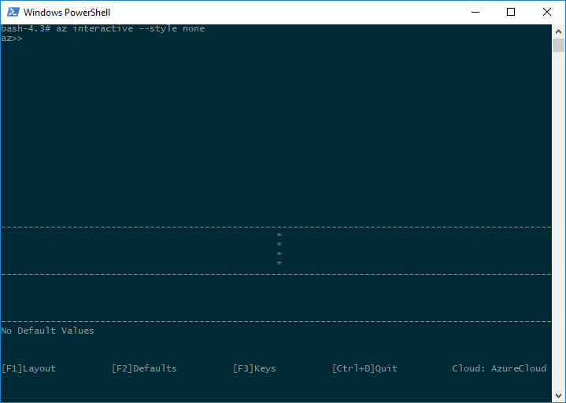
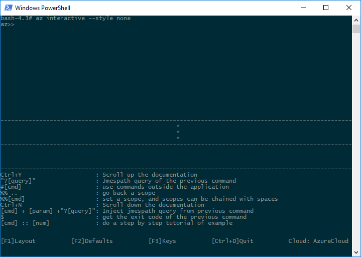
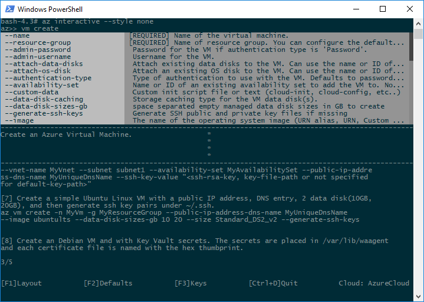

# Interactive Azure CLI 2.0

You can use Azure CLI 2.0 in interactive mode by running the `az interactive` command.
This mode places you in an interactive shell with auto-completion, command descriptions, and examples.


> [!NOTE]
> We're not using the default style here, which doesn't read as well on a black background.

If you're not already signed in to your account, use the `login` command.

## Configure

Interactive mode optionally displays command descriptions, parameter descriptions, and command examples.
Turn descriptions and examples on or off using `F1`.



You can turn the display of parameter defaults on or off using `F2`.



`F3` toggles the display of some key gestures.



## Scope

You can scope your interactive mode to a specific command group like `vm` or `vm image`.
When you do, all commands are interpreted in that scope.
It's a great shorthand if you're doing all your work in that command group.

Instead of typing these commands:

```azurecli
az>> vm create -n myVM -g myRG --image UbuntuLTS
az>> vm list -o table
```

You can scope to the vm command group and type these commands:

```azurecli
az>> %%vm
az vm>> create -n myVM -g myRG --image UbuntuLTS
az vm>>list -o table
```

You can scope to lower-level command groups as well.
You could scope to `vm image` using `%%vm image`.
In this case, since we're already scoped to `vm`, we would use `%%image`.

```azurecli
az vm>> %%image
az vm image>>
```

At that point, we can pop the scope back up to `vm` using `%%..`,
or we can scope to the root with just `%%`.

```azurecli
az vm image>> %%
az>>
```

## Query

You can execute a JMESPath query on the results of the last command that you executed.
For example, after you create a VM, you can make sure it has fully provisioned.

```azurecli
az>> vm create --name myVM --resource-group myRG --image UbuntuLTS --no-wait
az>> ? [*].provisioningState
```

```output
[
  "Creating"
]
```

To learn more about querying the results of your commands,
see [Query command results with Azure 2.0](query-azure-cli.md).

## Bash commands

You can run shell commands without leaving interactive mode using `#[cmd]`.

```azurecli
az>> #dir
```

## Examples

Some commands have lots of examples.
You can scroll to the next page of examples using `CTRL-N` and the previous page using `CTRL-Y`.



You can also look at a specific example using `::#`.

```azurecli
az>> vm create ::8
```
